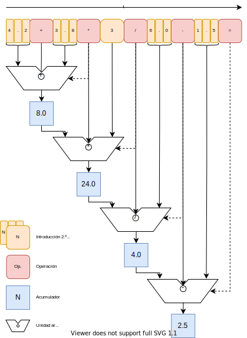
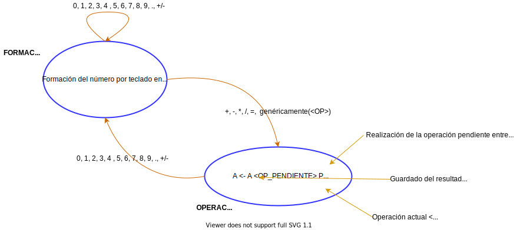

<h3 align="center">Aplicaciones Telemáticas</h3>


<h1 align="center"><b>Calculadora en Android</b></h1>
<h3 align="center"><b>Práctica 3</b></h3>

<h4 align="center"><b>P. Beneit Mayordomo</b></br><b>J. E. López Patiño</b><br>
<b>F. J. Martínez Zaldívar</b></h4>

<h3 align="center">Grado en Ingeniería de Tecnologías y Servicios de Telecomunicación</h3>
<h3 align="center">ETSIT-UPV</h3>

# 1. Introducción y objetivos

Con este ejercicio  se pretende que el alumno se familiarice con
aspectos básicos de la programación en Android como son el diseño de
actividades sencillas, interacción con la interfaz gráfica, utilización
de distintas fuentes de texto, logos de la aplicación, uso de algunas
clases específicas de Android, etc.

Para ello se plantea como objetivo diseñar una aplicación Android que
consista en una sencilla calculadora con las cuatro operaciones básicas:
suma, resta, multiplicación y división.

Aunque se van a proporcionar algunas sugerencias, e incluso el layout de
los elementos *view* de los que consta la aplicación, hay completa
libertad en cuanto al diseño de dicha aplicación.

Una vez plena y correctamente operativa la aplicación, se propone
resolver algunas cuestiones estéticas y funcionales y ampliarla
añadiendo funciones más complejas como funciones transcendentales,
manejo de paréntesis, etc., de manera completamente voluntaria.

## 1.1 Clonación

Se sugiere que desde el propio IDE Android Studio se clone el presente repositorio. Si no hay errores deberá tener una plantilla de la práctica que deberá rellenar. Como se podrá observar, el fichero `MainActivity.java` está rellenado de forma inicial con una plantilla de tipo actividad vacía. Sin embargo, el recurso `activity_main.xml` está ya relleno con unos elementos `View` que conforman un visor y teclado de calculadora, que en cualquier caso, puede ser modificable por el alumno. Los estilos por defecto cambian de versión a versión, por lo que es probable que se encuentre con una *layout* con botones muy cercanos entre ellos, por lo que se sugiere, en tal caso, que se aumente la separación, por ejemplo con un atributo `android:layout_margin="2dp"`; asimismo, también se sugiere que se cambie el color del botón si no es del gusto del alumno.


Junto con la documentación de la práctica, se proporciona una solución
en el fichero `doc/calculadora.apk` que es el ejecutable de la
aplicación. De modo que bien arrastrándolo al escritorio del terminal
virtual o bien haciéndolo llegar de alguna manera (por ejemplo mediante
Google Drive) al terminal real (probablemente, vía email será bloqueado
por sospecha de virus), podemos tener una posible solución al problema
planteado, para tomarlo como referencia. Esta calculadora no es fiable
ya que no ha sido verificada y muy probablemente tendrá fallos. Os
agradeceríamos que recopiláseis estos fallos y nos los hagáis llegar
para poder corregirlos.

# 2. Funcionalidad de la calculadora

La funcionalidad inicial a conseguir es la de una calculadora sencilla y
convencional sin grandes pretensiones. Las características a conseguir
deberían ser las siguientes:

1. Introducción de números enteros o decimales en coma fija (sin
    notación exponencial): internamente, dentro de la aplicación, el
    tipo a emplear que represente a los operandos o resultados, se
    sugiere que sea `double`, no `float`, para tener una mayor precisión
    en los cálculos.

2. Operaciones binarias: suma, resta, multiplicación y división

3. Operación unaria: cambio de signo

4. Operación de borrado de operando (con el que se borra el operando
    actual pudiendo escribir uno nuevo) y si se pulsa dos veces se
    cancela además la operación pendiente con el operando acumulado.

5. Operación resultado o igualdad: evaluación del resultado

6. Por simplicidad, no se considerará  diferencia en la precedencia de operadores, por lo que la evaluación siempre será de izquierda a derecha independientemente del operador. Es decir:

```text
4.2 + 3.8 * 3 / 6.0 - 1.5 =
```

se evaluará como:

```text
((((4.2 + 3.8) * 3) / 6.0) - 1.5) = 2.5
```


Hay infinidad de formas de abordar el problema. Se sugiere que se emplee
un *acumulador*    en el que se guardará el resultado de las
operaciones y además se reutilizará como operando en las operaciones
binarias junto con el operando que aparece en pantalla.

Téngase en cuenta que el número u operando de la pantalla se formará a
partir de la interacción con el teclado, escribiendo los dígitos y
potencialmente el punto decimal (se sugiere que esto se haga en un
`String`) en la pantalla, y que posteriormente se convertirá a un
`double` con el que ya se podrá operar aritméticamente. Si se observa el
fichero `activity_main.xml` en el que ya está creado toda una propuesta
de *layout*, todas las *teclas* tienen un atributo `android:id` que
permite identificarlas y además, otro atributo `android:onClick` cuyo
valor es `"botonPulsado"` lo que indica que el método
`public void botonPulsado(View v){…}` será el invocado cuando cliquemos
cualquier botón, luego el tratamiento de la interacción y la
discriminación sobre el botón clicado debería realizarse en dicho
método.

<div id="fig:calc">
<p align="center"><br/>

</p>
<p align="center"><b>Figura 1</b>: Ejemplo de aspecto de la calculadora</p><br/>
</div>

A partir de aquí habrá que establecer una estrategia algorítmica para
intentar imitar el comportamiento habitual de calculadoras sencillas.
Quedan por determinar una infinidad de detalles, pero que intuitivamente
se pueden deducir y resolver de manera muy personal, por lo que no hay
una única forma de abordar la solución.

# 2.1. Estrategia algorítmica

El grupo puede establecer la estrategia algorítmica que estime mejor para abordar el problema. En los siguientes párrafos vamos a sugerir algunas ideas que permitan establecer una posible estrategia de entre las múltiples que se podrían plantear.

Supongamos que queremos emular la siguiente secuencia de entrada de operandos y operadores:

```text
4.2 + 3.8 * 3 / 6.0 - 1.5 =
```

Vamos a intentar *dibujar* el problema, para ver si *dibujando* la solución, podemos llegar a un algoritmo que posteriormente nos permita codificar o programar dicha solución.


En la [figura 2](#fig:secuencia1) podemos observar una propuesta para llevar a cabo la citada secuencia de operaciones.

Como la interacción con la calculadora es a través de las pulsaciones de los botones, un número no acaba de definirse hasta que se pulsa una tecla de operación. Es decir, en nuestro ejemplo: `4.2+3.8...` el primer número `4.2` claramente no se acaba de definir hasta que se pulsa un botón de operación (`+` en este caso). Ello implica que en una secuencia genérica `N1 OP1 N2 OP2 ...` siendo `Ni` y `OPi` números y operadores respectivamente, la operación `N1 OP1 N2` no podrá ejecutarse hasta que acabe de definirse en el teclado `N2` o dicho de otra manera, hasta que no se pulse la tecla de la operación `OP2`.

Un ejemplo de lo comentado en el párrafo anterior puede desprenderse de la [figura 2](#fig:secuencia1), en la que tras la introducción de un primer operando (`4.2`), después, un operador (`+`) y luego, un segundo operando (`3.8`) &#x2014;operando que, por cierto, no se define hasta que se pulsa la tecla correspondiente al siguiente operador (`*`)&#x2014; se produce el resultado parcial de `8` a la salida de la primera unidad aritmética.

<div id="fig:secuencia1">
<p align="center"><br/>

</p>
<p align="center"><b>Figura 2</b>: secuencia de operandos y operadores</p><br/>
</div>

La operación no se lleva a cabo temporalmente hasta que se pulsa la tecla correspondiente al operador `*` lo cual se denota mediante una línea intermitente que va desde el operador `*` hasta la entrada lateral de la primera unidad aritmética. Del mismo modo, la siguiente operación, es decir, `8` (primer operando ubicado dentro del acumulador, que denotaremos por `A`) multiplicado `*` por el segundo operando `3`, no se lleva a cabo hasta que aparece el siguiente operador `/` (de nuevo, se denota mediante una línea intermitente que va desde el operador `/` hasta la entrada lateral de la segunda unidad aritmética). Y así, sucesivamente...
Independientemente del dibujo, podemos empezar a concebir la solución algorítmica pensando que el acumulador será único y se reutilizará cada vez que hacemos operaciones, así como la unidad aritmética.


De alguna forma podríamos prestablecer la siguiente estrategia respecto a los operadores: 
- Dan paso a la ejecución de la operación aritmética pendiente de un estadio anterior
- Debe tenerse en cuenta como siguiente operación a realizar cuando aparezca de nuevo otro operador.

Vemos como surge la necesidad de tener un almacenamiento temporal que guarde provisionalmente el resultado de realizar la operación aritmética para utilizarlo como *primer operando* en la siguiente operación. A este almacenamiento lo hemos denominado en los párrafos anteriores *Acumulador* o simplemente `A`. Por motivos funcionales, conviene, tras obtener el resultado en el acumulador, mostrarlo en pantalla para que el usuario vaya viendo cómo va evolucionando el resultado de las operaciones aritméticas. Esto se muestra en la [figura 3](#fig:secuencia2) (que tan solo se diferencia de la [figura 2](#fig:secuencia1) en dicho detalle). 
De forma simbólica denotaremos esta escritura en pantalla como una asignación a cierta variable denominada `P` (por Pantalla); del mismo modo, conforme vayamos definiendo el segundo operando con el teclado y vaya apareciendo en pantalla, haremos que este se cargue en la variable `P`, por lo que el rol asignado a esta variable `P` será el de ser el *segundo operando*.


<div id="fig:secuencia2">
<p align="center"><br/>

</p>
<p align="center"><b>Figura 3</b>: secuencia de operandos y operadores con actualización de la salida</p><br/>
</div>


Con todas estas consideraciones, podríamos acercarnos a una primera aproximación de una posible solución del problema si planteamos el siguiente diagrama de estados parcial:

<div id="fig:calc">
<p align="center"><br/>

</p>
<p align="center"><b>Figura 4</b>: diagrama de estados</p><br/>
</div>

en el que observamos dos estados:
- **FORMACIÓN**: seguiremos en él mientras pulsemos las teclas indicadas en la auto-transición del propio estado; mientras se va formando el número se va mostrando al mismo en pantalla.
- **OPERACIÓN**: en el que realizaremos la operación **pendiente** y guardaremos la operación que ha provocado la transición como siguiente operación **pendiente**. Asimismo, mostramos en pantalla el resultado de dicha operación y lo guardamos en la variable `P`, que representa lo que en un momento dado existe en la pantalla.

Si se toma en consideración esta sugerencia, debe tenerse en cuenta cuáles deberían ser las condiciones iniciales.

Como consecuencia de lo anterior, se supone que si se pulsan consecutivamente teclas correspondientes a operaciones sin operadores por el medio, se siguen realizando las operaciones como se indican, siendo ahora el segundo operando una copia del acumulador. Se sugiere que se verifique este comportamiento.

El grupo puede replantear el diagrama de estados como le parezca oportuno. Quedan todavía algunos detalles que perfilar, pero con estas ideas, el grupo puede ir acercándose cada vez más a una idea algorítmica que resuelva el problema.

# 3. Detalles de la aplicación

Se sugiere que inicialmente se obtenga una mínima versión funcional,
dejando pendientes algunos problemas a resolver como por ejemplo la
aparición de algunos dígitos decimales tras algunas operaciones
aritméticas, consecuencia de la precisión finita de los números en coma
flotante; considérese sólo un
funcionamiento con orientación vertical o `portrait`. Para este último problema, podemos evitar que
se destruya la actividad cuando se gira el móvil, conservando, por lo
tanto, la orientación de la actividad con:

```java
setRequestedOrientation(ActivityInfo.SCREEN_ORIENTATION_PORTRAIT);
```

tras `setContentView(…);`, dentro del método `onCreate(…)`.

Y una vez conseguida la calculadora mínimamente operativa y correcta,
entonces puede ser momento para abordar aspectos que podríamos
considerar secundarios como:

- El valor textual inicial del `TextView` que representa la pantalla
    de la calculadora (con `android:id="operando_2"`, &#x2014;ya que se
    supone implícitamente que el operando 1 será el *propuesto*
    acumulador&#x2014;), es un `String` cuyo inicialización XML es
    `android:text="0"`; la intención es cambiar ese *String* `"0"` por
    un recurso de tipo `String`

- Fuente para los dígitos. Es muy sencillo trabajar con una fuente
    adicional en nuestra aplicación. Los pasos a seguir podrían ser los
    siguientes:

  - Descargar la fuente:

    - Se sugiere que del sitio web `https://fonts.google.com/` se busque y se descargue la fuente **Orbitron** (o cualquier otra que al alumno le guste y que sea gratuita).

    - Descárguese la familia completa (`Download family`, en la esquina superior derecha): fichero `zip`.

  - Introducirla en el proyecto:

    Descomprímase el fichero `.zip` y cópiese, por ejemplo, el
    fichero denominado `Orbitron-VariableFont_wght.ttf` (la
    extensión `.ttf` denota *true type font*, que son fuentes
    escalables) y llévese a la carpeta `font` dentro de la carpeta
    `res` de Android Studio. Si no aparece la subcarpeta `font`, se
    puede forzar a que se muestre creando un recurso de tipo *font*.
    Para ello:

    - `File`&#x2192;`New`&#x2192;`Android Resource File`

    - En la ventana que aparece, introdúzcase

      - Un nombre arbitrario de fichero (`fuentes`, por ejemplo): `File name: fuentes`

      - Y un tipo de recursos `font`: `Resource type: font`

        Con lo que ya se debería mostrar la carpeta `font` bajo `res` en
        la que deberíamos copiar el citado fichero `.ttf` (`CTRL-C`&#x2192;`CTRL-V`). Deberíamos considerar modificar el
        nombre del fichero `.ttf` ya que, para los nombres de los
        recursos solo se admiten letras minúsculas, números y el
        carácter de subrayado.

    - Referenciarla: en el elemento XML `TextView` que contiene el
        operando, añádase el atributo

        `android:fontFamily="@font/<NOMBRE_DE_LA_FUENTE>"`,

        donde `<NOMBRE_DE_LA_FUENTE>` es el nombre definitivo con el que
        finalmente aparece el recurso `.ttf` bajo la carpeta `font`.

    De esta manera conseguiremos que el número escrito en la pantalla,
    aparezca con la fuente indicada, tal y como se muestra en la app
    ejemplo o en la [figura 1](#fig:calc).

- Conversión de formatos y formato del número en la pantalla.

    Mientras se está formando el número, acumulando los caracteres correspondientes a los dígitos o cuando un valor numérico se desea que se escriba en pantalla, hay que trabajar con variables de tipo `String`. Cuando se desean hacer operaciones numéricas, se sugiere que se trabaje con variables de tipo `Double`. Consecuentemente, durante la ejecución del programa, vamos a estar cambiando de formatos en un sentido y en otro.

    Para obtener una variable de tipo `Double` a partir de un `String` lo más sencillo es emplear el método estático 
    
    ```java
    double x = Double.parseDouble("-1.234");
    ```

    tomando todas las precauciones y controles posibles para evitar una excepción que arruine el programa.

    En el sentido opuesto, es decir, para convertir un `double` en un `String`, por ejemplo, para escribirlo en un elemento de la clase `TextView`,
    puede simplemente convertirse a `String` con una simple concatenación con la cadena vacía:

    ```java
    TextView operando; 
    double numero;
    ...
    operando.setText(""+numero)
    ```

    Pero podremos comprobar cómo por cuestiones del error de redondeo
    por la precisión finita de los números en coma flotante, aparecen de
    vez en cuando, decimales que nos gustaría eliminar. La clase
    `java.text.DecimalFormat` nos puede ser de gran utilidad. Por
    ejemplo:

    ```java
    TextView operando; 
    double numero;
    ...
    DecimalFormat df = new DecimalFormat("#.#############");
    operando.setText(df.format(numero));
    ```

    nos formateará el número en coma flotante con un máximo de 14
    dígitos significativos (14 caracteres `#`), de una manera a la que
    estamos más acostumbrados cuando interactuamos con una calculadora
    convencional. (Búsquese más información sobre la clase
    `java.text.DecimalFormat` y **no confundirla** con la clase
    `android.icu.text.DecimalFormat` cuya funcionalidad es distinta).

- Layouts: se sugiere que se rediseñe un layout para la orientación
    horizontal, apaisada o `landscape` y que se tenga en cuenta el
    guardado y posterior recuperación del estado de la actividad
    empleando oportunamente los métodos `onSaveInstanceState(…)` y
    `onRestoreInstanceState(…)` u `onCreate(…)`. Para ello, habrá que
    eliminar o comentar la instrucción que impedía que la interfaz gráfica de la
    actividad girara con el cambio de orientación del móvil:

    ```java
    //setRequestedOrientation(ActivityInfo.SCREEN_ORIENTATION_PORTRAIT);
    ```

    En el nuevo *layout*, podría tenerse una disposición distinta a la
    original: por ejemplo, teclado en la mitad derecha y número en la
    izquierda, o como el alumno desee.

- Añádase un logo de aplicación y cámbiese el nombre de la misma:

  - Conviene tener varias versiones del fichero gráfico del logo, en función de la
    densidad de píxeles en la pantalla. Hay una herramienta que lo
    hace automáticamente: `File`&#x2192;`New`&#x2192;`Image Asset`. Para
    generalizar, se sugiere que se escoja un tipo de icono *Launcher
    Icons (Adaptive y Legacy)*. Se debe proporcionar un nombre y
    después elegir el icono (puede ser una imagen, un *clip art* o
    un texto); se sugiere que sea una imagen y que se especifique en
    el cajetín *Path*. A continuación con las opciones *Trim/resize*
    se ajusta el icono al área disponible y después se confirma todo
    lo que viene a continuación.

  - En el fichero `AndroidManifest.xml` hay que indicar la nueva
    elección, modificando los atributos `android:icon` y
    `android:roundIcon` al nombre del nuevo icono

  - El nombre de la aplicación puede modificarse en el fichero de
    recursos `strings.xml`, dentro de la carpeta `res` modificando
    el elemento XML `string` cuyo atributo `name` es `"app_name"`.

- Extensión de la funcionalidad: añadiendo funciones trascendentales,
    memoria, etc.


# 4. Vídeos de apoyo


Se han preparado varios vídeos explicativos que ayudan y complementan la realización del ejercicio. Sus URL son las siguientes:
   - [Ejercicio Android: calculadora sencilla (I)](https://media.upv.es/player/?id=8af23620-8d9e-11ea-8842-9f9926e21c94)
   - [Ejercicio Android: calculadora sencilla (II)](https://media.upv.es/player/?id=4678a5d0-aab0-11eb-a2e5-bd6866a4c876)
   - [Ejercicio Android: calculadora sencilla (y III)](https://media.upv.es/player/?id=eae24cf0-8d9e-11ea-8842-9f9926e21c94)

Se sugiere que se visionen tras leer la presente memoria de prácticas y antes de la realización de la misma para entender más fácilmente algunos concpetos. Se sugiere también que se ejercite la labora de depuración o *debugging* ya que ello ayudará a identificar errores muy fácilmente.

# 5. Resultados a entregar

Debe actualizarse el proyecto Android del repositorio local en el remoto de GitHub. Esto puede llevarse a cabo mediantes las herramientas gráficas de apoyo a git que contiene Android Studio, o de manera convencional, en cualquier terminal tal y como se ha ido haciendo hasta ahora; terminal por cierto, que puede ser el que nos proporciona el propio Android Studio. Recuérdese que en cualquier caso, la mecánica consistía en añadir al *index* aquellos ficheros que se desee que formen parte del siguiente commit:

```bash
git add -A // se añadirían todos los ficheros nuevos, modificados y borrados de todo el directorio de trabajo
```

Creación de un commit:

```bash
git commit -m "Mensaje"
```

Esta operación add-commit puede realizarse cuantas veces lo considere oportuno cada integrante del grupo.
Se sugiere que se vayan realizando  regularmente *commits* para ir guardando en el
respositorio local las instantáneas del directorio de trabajo que os
parezcan oportunas, así como realizar una sincronización del repositorio
local con el remoto en GitHub, para salvaguardar una copia de seguridad
del repositorio en la nube; si se usaron nombres *estándar* para servidores y ramas una posibilidad es:

```bash
git push origin master
```


A lo largo del desarrollo de la práctica, el grupo es completamente
libre de actualizar el repositorio local o remoto como lo estime
oportuno, con las ramas o los *commits* que estimen necesarios, pero
respetando los *commits* y *tags* explicitados, como puntos de control. La forma de trabajar
se denomina genéricamente *workflow* y convendría aclararla antes de comenzar, es decir, repartir las tareas y utilizar las herramientas que el propio GitHub proporciona para llevar a cabo la comunicación entre los integrantes del grupo, como las *issues*. Se valorará que haya una intensa interacción con el repositorio remoto.


Si el grupo realiza  consultas através de las *issues* de GitHub, recuérdese antes,
actualizar el repositorio remoto en GitHub e indicar como *assignees*
tanto al profesor como a todos los integrantes del grupo para que
lleguen notificaciones vía email de que hay una *issue* pendiente de ser
contestada.


## 5.1. Etiquetado

Cada alumno integrante del grupo deberá etiquetar individualmente tanto el último *commit* de su sesión de prácticas como el de la práctica en sí (si queda algún detalle pendiente, dentro de los tres días lectivos siguientes). Las etiquetas tendrán el formato `prN.sesion.fin.<USUARIO_DE_GITHUB>` y `prN.fin.<USUARIO_DE_GITHUB>` respectivamente, donde `N` denota el número de práctica. Estos *commits* deben estar ubicados obligatoriamente en la rama `master`.


Ello puede implicar que si los miembros del grupo hacen la práctica en la misma sesión y la finalizan en dicha sesión, el  *commit* en cuestión tendrá las 4 etiquetas. Si en ese mismo caso, quedan detalles pendientes por finalizar durante los tres siguientes días lectivos, cuando el considerado como último *commit* de la práctica esté en el repositorio, ambos alumnos etiquetarán dicho *commit*, a ser posible en el mismo instante.

Siguiendo con la casuística, si ambos miembros hacen la práctica en días distintos, entonces cada vez que un integrante finalice su sesión de prácticas, etiquetará su último *commit* con `pr3.sesion.fin.<USUARIO_DE_GITHUB>`. Cuando se dé la práctica por finalizada en cierto último *commit*, este deberá ser etiquetado por ambos con la etiqueta `prN.fin.<USUARIO_DE_GITHUB>`, a ser posible el mismo día.

Las etiquetas debe ponerlas cada alumno a título individual (un alumno no podrá etiquetar un *commit* por el otro, ya que la autoría de las etiquetas aparece reflejada en el repositorio). Ello obligará a que el alumno en cuestión tenga que tener sincronizado su repositorio local con el remoto en el momento de realizar el etiquetado.

**MUY IMPORTANTE**: se tiende a confundir mensajes de commit con etiquetas. Es decir, cuando se hace un commit, se añade un mensaje:

```bash
git commit -m "Mensaje"
```

`"Mensaje"` **NO** es la etiqueta del commit. Para etiquetar un commit, recuérdese que se debe emplear el comando `tag` oportunamente. Recuérdese que con 

```bash
git tag <ETIQUETA> <REFERENCIA>
```

Se etiqueta con el nombre `<ETIQUETA>` el *commit* cuyo hash, *commit* relativo a puntero o hash es `<REFERENCIA>`. Por ejemplo:

```bash
git tag prN.sesion.fin.fjmz-UPV master
```

etiqueta el commit apuntado por el puntero de rama `master` con la etiqueta `prN.sesion.fin.fjmz-UPV`.


Y con

```bash
git push origin --tags
```

se suben exclusivamente las etiquetas al repositorio remoto ubicado en el servidor `origin`.


